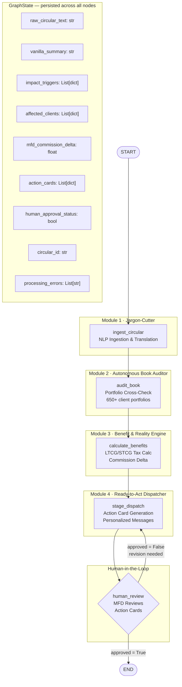

# Agentic Regulatory Sentinel — Architecture

## LangGraph State Machine



## Node Responsibilities

| Node | Module | Input | Output |
|------|--------|-------|--------|
| `ingest_circular` | Jargon-Cutter | `raw_circular_text` | `vanilla_summary`, `impact_triggers`, `circular_id` |
| `audit_book` | Book Auditor | `impact_triggers` | `affected_clients` |
| `calculate_benefits` | Benefit Engine | `affected_clients`, `impact_triggers` | `mfd_commission_delta`, enriched `affected_clients` |
| `stage_dispatch` | Dispatcher | All state | `action_cards` |
| `human_review` | HITL | `action_cards` | `human_approval_status` |

## Data Flow

```
SEBI/AMFI Circular PDF Text
        │
        ▼
[Jargon-Cutter] ──► Vanilla Summary (plain English)
        │            Impact Triggers JSON
        │              ├─ mandate_id
        │              ├─ rule_change
        │              ├─ fund_categories_impacted
        │              ├─ effective_date / deadline
        │              └─ client_filter criteria
        │
        ▼
[Book Auditor] ──► Affected Clients List
        │            Per client:
        │              ├─ client_id, name
        │              ├─ affected_holdings
        │              └─ reason_for_impact (personalized)
        │
        ▼
[Benefit Engine] ──► Per client: LTCG/STCG tax impact
        │                         next_best_action
        │            MFD-level: commission_delta estimate
        │
        ▼
[Dispatcher] ──► Action Cards (dashboard payload)
        │          Per card:
        │            ├─ vanilla_summary
        │            ├─ impacted client list
        │            ├─ commission_delta
        │            └─ pre-drafted personalized messages
        │
        ▼
[Human Review] ──► MFD approves → END
   (interrupt)      MFD rejects → back to Dispatcher
```
